# Architecture

How the integration is built. Design documents per issue are in [`design/`](design/).

## 1. Overview

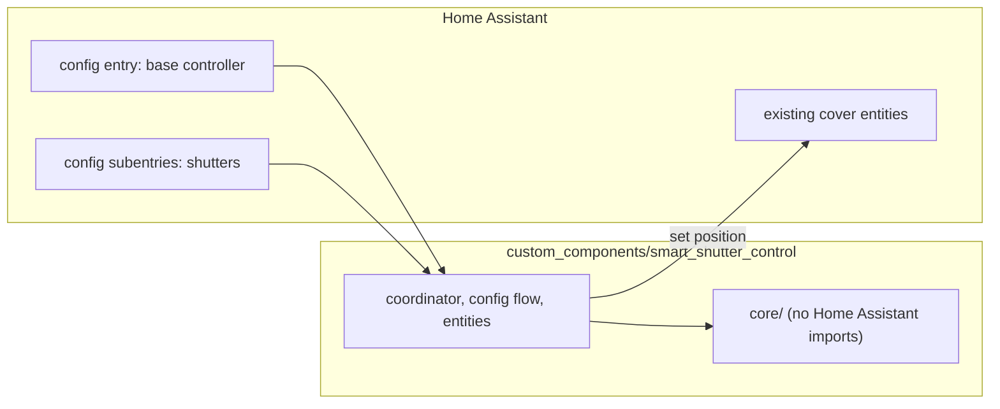
```mermaid
flowchart LR
  subgraph HA["Home Assistant"]
    CE["config entry: base controller"]
    SE["config subentries: shutters"]
    COV["existing cover entities"]
  end
  subgraph INT["custom_components/smart_shutter_control"]
    GLUE["coordinator, config flow, entities"]
    CORE["core/ (no Home Assistant imports)"]
  end
  CE --> GLUE
  SE --> GLUE
  GLUE --> CORE
  GLUE -->|set position| COV
```

- `core/` holds the logic (sun geometry, rules, calibration) as plain Python, tested with pytest.
- The Home Assistant layer reads inputs, calls `core/` and moves the shutters.
- `frontend/` holds the Lovelace card (TypeScript, Lit), built into the integration (§10).

### 1.1 The rule chain today

| Priority | Rule | Module | Kind |
|---|---|---|---|
| 10 | `StormRule` | `core/weather.py` | final: 0 or 100 |
| 11 | `FrostRule` | `core/weather.py` | final: no move |
| 15 | `TemperatureLimitRule` | `core/weather.py` | final: closed |
| 20 | `ManualPauseRule` | `core/manual.py` | final: no move |
| 30 | `SleepInRule` | `core/daily.py` | target |
| 40 | `HeatProtectionRule` | `core/heat.py` | cap |
| 41 | `GlareProtectionRule` | `core/glare.py` | cap |
| 50 | `WinterRule` | `core/winter.py` | target or cap |
| 60 | `ScheduleRule` | `core/daily.py` | target |

The chain is built in `ShutterController.__init__`; `PositionLimiter` applies the maximum position after it.

## 2. Design principles

| Principle | How |
|---|---|
| Single responsibility | one module per concern; one class per rule |
| Dependency inversion | `core/` depends on its own protocols, not on Home Assistant |
| **Chain of responsibility** | `RuleChain` asks every `Rule` by priority: the first target wins, caps may lower it, a final target (safety) is not lowered (#2, #3) |
| **State** | `HeatProtectionRule` phases open → pending → shading → leaving (#3); `DaySchedule` phases night → slit → day → dusk (#4); `ManualDetector` idle → commanded → manual (#5) |
| **Template / inheritance of settings** | `merged(base, overrides)`: every shutter takes the base schedule unless it overrides a setting (#4) |
| **Strategy** | `Calibration` (`IdentityCalibration`, `RollerCalibration`) and `Curve` (`QuadraticCurve`, `MonotoneCurve`) |
| **Factory method** | `fit_curve` picks the roller model or the monotone fallback; `RollerCalibration.from_data` |
| **Adapter** | `CoverAdapter` is the only code that moves a physical cover; the ends (100, 0) go by `open_cover`/`close_cover` when the cover supports them, so the module runs to its limit switch |
| **Observer** | the entities listen to `BaseCoordinator` |
| **Repository** | `RuntimeStore` keeps the runtime state per shutter (automatic on/off, maximum position, sleep-in, manual pause, last target) and globals (winter mode, 24-hour outdoor temperatures, the learned clear-sky references for PV and lux). Settings are saved within 5 s, learned data within 5 minutes; a later, longer delay never postpones an earlier save, and unloading writes at once |

## 3. Scaffold (#1)

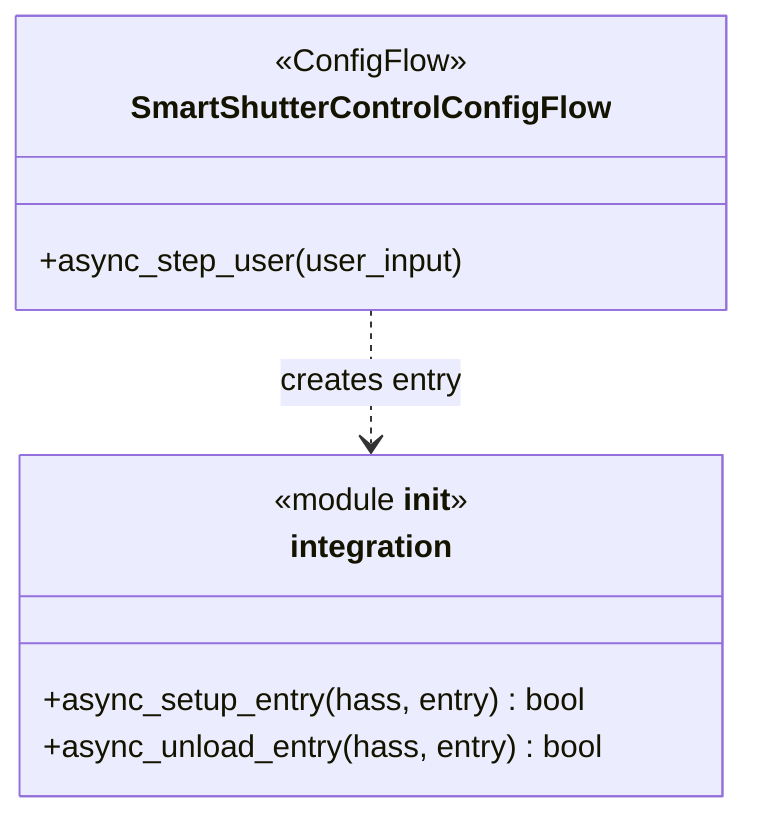
```mermaid
classDiagram
    class SmartShutterControlConfigFlow {
        <<ConfigFlow>>
        +async_step_user(user_input)
    }
    class integration {
        <<module __init__>>
        +async_setup_entry(hass, entry) bool
        +async_unload_entry(hass, entry) bool
    }
    SmartShutterControlConfigFlow ..> integration : creates entry
```

## 4. Base controller and shutters (#2)

Design: [`design/2026-11-19-base-controller-and-shutters.md`](design/2026-11-19-base-controller-and-shutters.md).

### 4.1 Configuration and devices

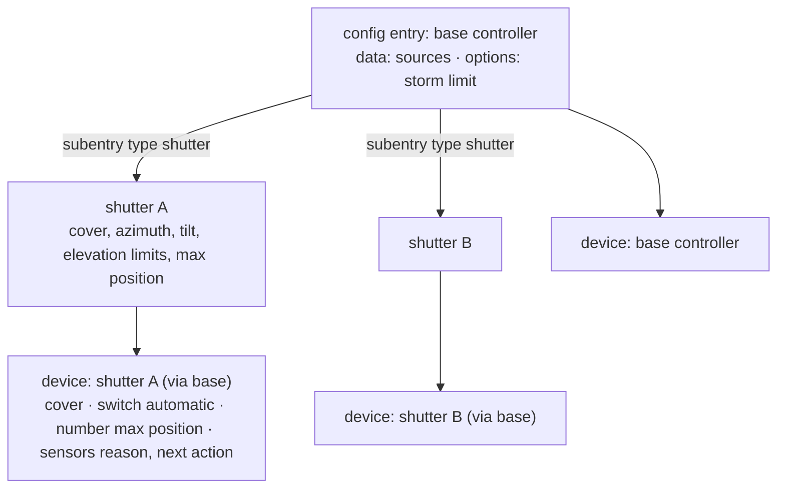
```mermaid
flowchart TB
  E["config entry: base controller<br/>data: sources · options: storm limit"]
  E -->|subentry type shutter| S1["shutter A<br/>cover, azimuth, tilt, elevation limits, max position"]
  E -->|subentry type shutter| S2["shutter B"]
  E --> BD["device: base controller"]
  S1 --> D1["device: shutter A (via base)<br/>cover · switch automatic · number max position · sensors reason, next action"]
  S2 --> D2["device: shutter B (via base)"]
```

### 4.2 Classes

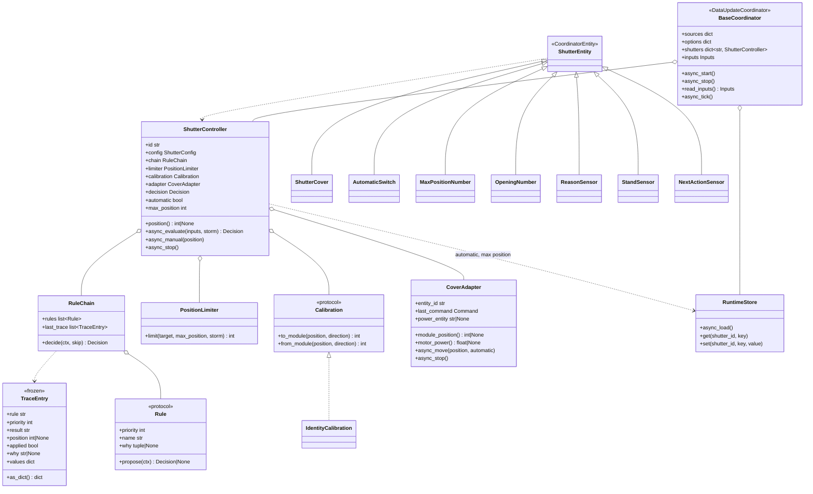
```mermaid
classDiagram
    direction TB
    class BaseCoordinator {
        <<DataUpdateCoordinator>>
        +sources dict
        +options dict
        +shutters dict~str, ShutterController~
        +inputs Inputs
        +async_start()
        +async_stop()
        +read_inputs() Inputs
        +async_tick()
    }
    class ShutterController {
        +id str
        +config ShutterConfig
        +chain RuleChain
        +limiter PositionLimiter
        +calibration Calibration
        +adapter CoverAdapter
        +decision Decision
        +automatic bool
        +max_position int
        +position() int|None
        +async_evaluate(inputs, storm) Decision
        +async_manual(position)
        +async_stop()
    }
    class RuleChain {
        +rules list~Rule~
        +last_trace list~TraceEntry~
        +decide(ctx, skip) Decision
    }
    class Rule {
        <<protocol>>
        +priority int
        +name str
        +why tuple|None
        +propose(ctx) Decision|None
    }
    class TraceEntry {
        <<frozen>>
        +rule str
        +priority int
        +result str
        +position int|None
        +applied bool
        +why str|None
        +values dict
        +as_dict() dict
    }
    RuleChain ..> TraceEntry
    class PositionLimiter {
        +limit(target, max_position, storm) int
    }
    class Calibration {
        <<protocol>>
        +to_module(position, direction) int
        +from_module(position, direction) int
    }
    class IdentityCalibration
    class CoverAdapter {
        +entity_id str
        +last_command Command
        +module_position() int|None
        +power_entity str|None
        +motor_power() float|None
        +async_move(position, automatic)
        +async_stop()
    }
    class RuntimeStore {
        +async_load()
        +get(shutter_id, key)
        +set(shutter_id, key, value)
    }
    class ShutterEntity {
        <<CoordinatorEntity>>
    }
    ShutterEntity <|-- ShutterCover
    ShutterEntity <|-- AutomaticSwitch
    ShutterEntity <|-- MaxPositionNumber
    ShutterEntity <|-- OpeningNumber
    ShutterEntity <|-- ReasonSensor
    ShutterEntity <|-- StandSensor
    ShutterEntity <|-- NextActionSensor
    BaseCoordinator o-- ShutterController
    BaseCoordinator o-- RuntimeStore
    ShutterController o-- RuleChain
    RuleChain o-- Rule
    ShutterController o-- PositionLimiter
    ShutterController o-- Calibration
    Calibration <|.. IdentityCalibration
    ShutterController o-- CoverAdapter
    ShutterController ..> RuntimeStore : automatic, max position
    ShutterEntity ..> ShutterController
```

`core/` (no Home Assistant): `ShutterConfig`, `Inputs`, `ShutterContext`, `Decision`, `Reason`, `Direction`,
`RuleChain`, `Rule`, `PositionLimiter`, `Calibration`, `IdentityCalibration`.

### 4.3 A tick

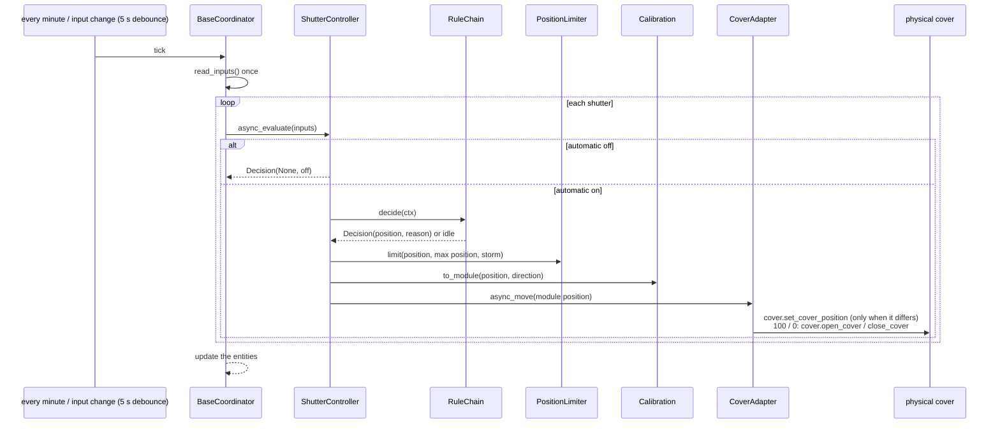
```mermaid
sequenceDiagram
    participant T as every minute / input change (5 s debounce)
    participant C as BaseCoordinator
    participant SC as ShutterController
    participant R as RuleChain
    participant L as PositionLimiter
    participant K as Calibration
    participant A as CoverAdapter
    participant HA as physical cover
    T->>C: tick
    C->>C: read_inputs() once
    loop each shutter
        C->>SC: async_evaluate(inputs)
        alt automatic off
            SC-->>C: Decision(None, off)
        else automatic on
            SC->>R: decide(ctx)
            R-->>SC: Decision(position, reason) or idle
            SC->>L: limit(position, max position, storm)
            SC->>K: to_module(position, direction)
            SC->>A: async_move(module position)
            A->>HA: cover.set_cover_position (only when it differs)<br/>100 / 0: cover.open_cover / close_cover
        end
    end
    C-->>C: update the entities
```

### 4.4 Manual operation through the shutter entity

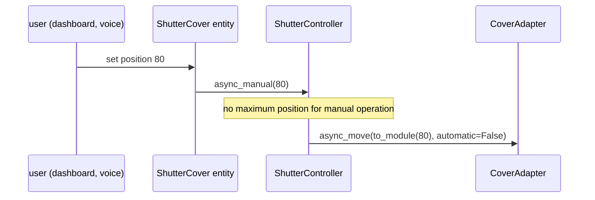
```mermaid
sequenceDiagram
    participant U as user (dashboard, voice)
    participant E as ShutterCover entity
    participant SC as ShutterController
    participant A as CoverAdapter
    U->>E: set position 80
    E->>SC: async_manual(80)
    Note over SC: no maximum position for manual operation
    SC->>A: async_move(to_module(80), automatic=False)
```

## 5. Calibrated positions (#10)

Design: [`design/2026-11-20-calibration.md`](design/2026-11-20-calibration.md).

### 5.1 Classes

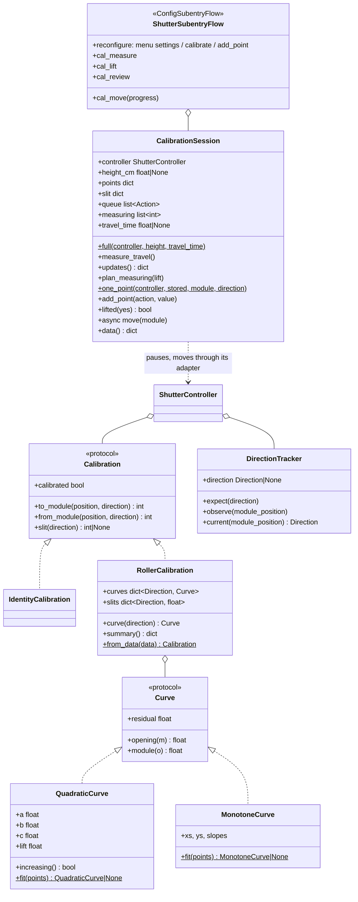
```mermaid
classDiagram
    direction TB
    class Calibration {
        <<protocol>>
        +calibrated bool
        +to_module(position, direction) int
        +from_module(position, direction) int
        +slit(direction) int|None
    }
    class IdentityCalibration
    class RollerCalibration {
        +curves dict~Direction, Curve~
        +slits dict~Direction, float~
        +curve(direction) Curve
        +summary() dict
        +from_data(data)$ Calibration
    }
    class Curve {
        <<protocol>>
        +residual float
        +opening(m) float
        +module(o) float
    }
    class QuadraticCurve {
        +a float
        +b float
        +c float
        +lift float
        +increasing() bool
        +fit(points)$ QuadraticCurve|None
    }
    class MonotoneCurve {
        +xs, ys, slopes
        +fit(points)$ MonotoneCurve|None
    }
    class DirectionTracker {
        +direction Direction|None
        +expect(direction)
        +observe(module_position)
        +current(module_position) Direction
    }
    class CalibrationSession {
        +controller ShutterController
        +height_cm float|None
        +points dict
        +slit dict
        +queue list~Action~
        +measuring list~int~
        +travel_time float|None
        +full(controller, height, travel_time)$
        +measure_travel()
        +updates() dict
        +plan_measuring(lift)
        +one_point(controller, stored, module, direction)$
        +add_point(action, value)
        +lifted(yes) bool
        +async move(module)
        +data() dict
    }
    class ShutterSubentryFlow {
        <<ConfigSubentryFlow>>
        +reconfigure: menu settings / calibrate / add_point
        +cal_move (progress)
        +cal_measure
        +cal_lift
        +cal_review
    }
    Calibration <|.. IdentityCalibration
    Calibration <|.. RollerCalibration
    RollerCalibration o-- Curve
    Curve <|.. QuadraticCurve
    Curve <|.. MonotoneCurve
    ShutterController o-- Calibration
    ShutterController o-- DirectionTracker
    ShutterSubentryFlow o-- CalibrationSession
    CalibrationSession ..> ShutterController : pauses, moves through its adapter
```

### 5.2 Moving to a real position

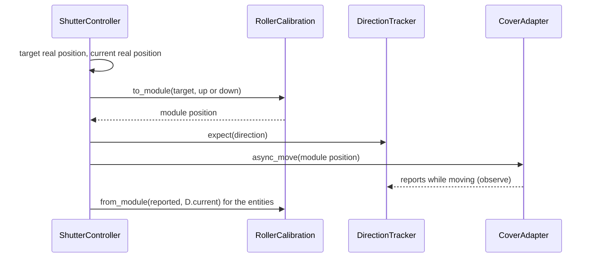
```mermaid
sequenceDiagram
    participant SC as ShutterController
    participant K as RollerCalibration
    participant D as DirectionTracker
    participant A as CoverAdapter
    SC->>SC: target real position, current real position
    SC->>K: to_module(target, up or down)
    K-->>SC: module position
    SC->>D: expect(direction)
    SC->>A: async_move(module position)
    A-->>D: reports while moving (observe)
    SC->>K: from_module(reported, D.current) for the entities
```

### 5.3 The assistant

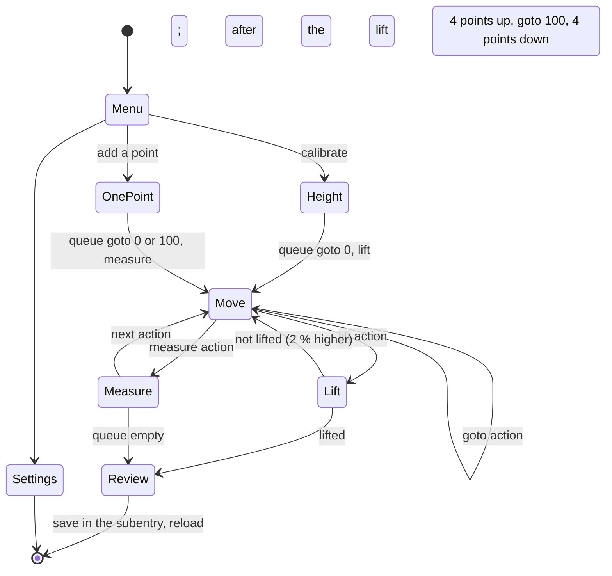
```mermaid
stateDiagram-v2
    [*] --> Menu
    Menu --> Settings
    Menu --> Height: calibrate
    Menu --> OnePoint: add a point
    Height --> Move: queue goto 0, lift; after the lift point: 4 points up, goto 100, 4 points down
    OnePoint --> Move: queue goto 0 or 100, measure
    Move --> Measure: measure action
    Move --> Lift: lift action
    Move --> Move: goto action
    Measure --> Move: next action
    Lift --> Move: not lifted (2 % higher)
    Lift --> Review: lifted
    Measure --> Review: queue empty
    Review --> [*]: save in the subentry, reload
    Settings --> [*]
```

During the assistant the controller is paused (`Reason.CALIBRATING`); ending the flow in any way resumes it.

### 5.4 Moving during the assistant

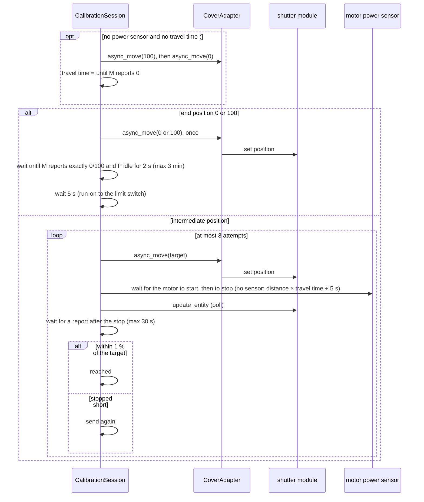
```mermaid
sequenceDiagram
    participant S as CalibrationSession
    participant A as CoverAdapter
    participant M as shutter module
    participant P as motor power sensor
    opt no power sensor and no travel time (#18)
        S->>A: async_move(100), then async_move(0)
        S->>S: travel time = until M reports 0
    end
    alt end position 0 or 100
        S->>A: async_move(0 or 100), once
        A->>M: set position
        S->>S: wait until M reports exactly 0/100 and P idle for 2 s (max 3 min)
        S->>S: wait 5 s (run-on to the limit switch)
    else intermediate position
        loop at most 3 attempts
            S->>A: async_move(target)
            A->>M: set position
            S->>P: wait for the motor to start, then to stop (no sensor: distance × travel time + 5 s)
            S->>M: update_entity (poll)
            S->>S: wait for a report after the stop (max 30 s)
            alt within 1 % of the target
                S->>S: reached
            else stopped short
                S->>S: send again
            end
        end
    end
```

## 6. Sun on the window (#3)

Design: [`design/2026-11-20-sun-on-the-window.md`](design/2026-11-20-sun-on-the-window.md).

### 6.1 Classes

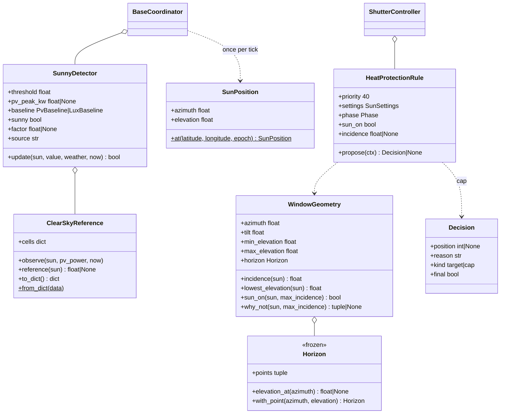
```mermaid
classDiagram
    direction TB
    class SunPosition {
        +azimuth float
        +elevation float
        +at(latitude, longitude, epoch)$ SunPosition
    }
    class WindowGeometry {
        +azimuth float
        +tilt float
        +min_elevation float
        +max_elevation float
        +horizon Horizon
        +incidence(sun) float
        +lowest_elevation(sun) float
        +sun_on(sun, max_incidence) bool
        +why_not(sun, max_incidence) tuple|None
    }
    class Horizon {
        <<frozen>>
        +points tuple
        +elevation_at(azimuth) float|None
        +with_point(azimuth, elevation) Horizon
    }
    WindowGeometry o-- Horizon
    class ClearSkyReference {
        +cells dict
        +observe(sun, pv_power, now)
        +reference(sun) float|None
        +to_dict() dict
        +from_dict(data)$
    }
    class SunnyDetector {
        +threshold float
        +pv_peak_kw float|None
        +baseline PvBaseline|LuxBaseline
        +sunny bool
        +factor float|None
        +source str
        +update(sun, value, weather, now) bool
    }
    class HeatProtectionRule {
        +priority 40
        +settings SunSettings
        +phase Phase
        +sun_on bool
        +incidence float|None
        +propose(ctx) Decision|None
    }
    class Decision {
        +position int|None
        +reason str
        +kind target|cap
        +final bool
    }
    SunnyDetector o-- ClearSkyReference
    HeatProtectionRule ..> WindowGeometry
    HeatProtectionRule ..> Decision : cap
    BaseCoordinator o-- SunnyDetector
    BaseCoordinator ..> SunPosition : once per tick
    ShutterController o-- HeatProtectionRule
```

### 6.2 A tick with the sun

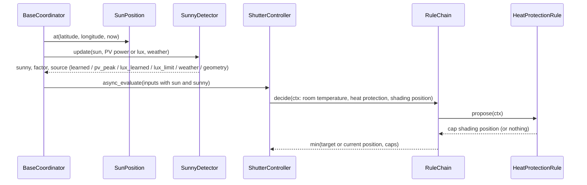
```mermaid
sequenceDiagram
    participant C as BaseCoordinator
    participant SP as SunPosition
    participant SD as SunnyDetector
    participant SC as ShutterController
    participant R as RuleChain
    participant H as HeatProtectionRule
    C->>SP: at(latitude, longitude, now)
    C->>SD: update(sun, PV power or lux, weather)
    SD-->>C: sunny, factor, source (learned / pv_peak / lux_learned / lux_limit / weather / geometry)
    C->>SC: async_evaluate(inputs with sun and sunny)
    SC->>R: decide(ctx: room temperature, heat protection, shading position)
    R->>H: propose(ctx)
    H-->>R: cap shading position (or nothing)
    R-->>SC: min(target or current position, caps)
```

### 6.3 Heat protection phases

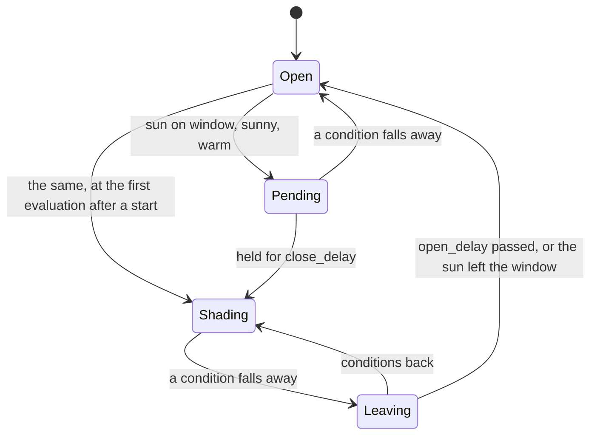
```mermaid
stateDiagram-v2
    [*] --> Open
    Open --> Pending: sun on window, sunny, warm
    Open --> Shading: the same, at the first evaluation after a start
    Pending --> Open: a condition falls away
    Pending --> Shading: held for close_delay
    Shading --> Leaving: a condition falls away
    Leaving --> Shading: conditions back
    Leaving --> Open: open_delay passed, or the sun left the window
```

The learned clear-sky reference is kept with the runtime state (`RuntimeStore.globals`, saved every few
minutes).

## 7. Profiles and manual operation (#4, #5)

Designs: [`design/2026-11-20-profiles.md`](design/2026-11-20-profiles.md),
[`design/2026-11-20-manual-operation.md`](design/2026-11-20-manual-operation.md).

### 7.1 Classes

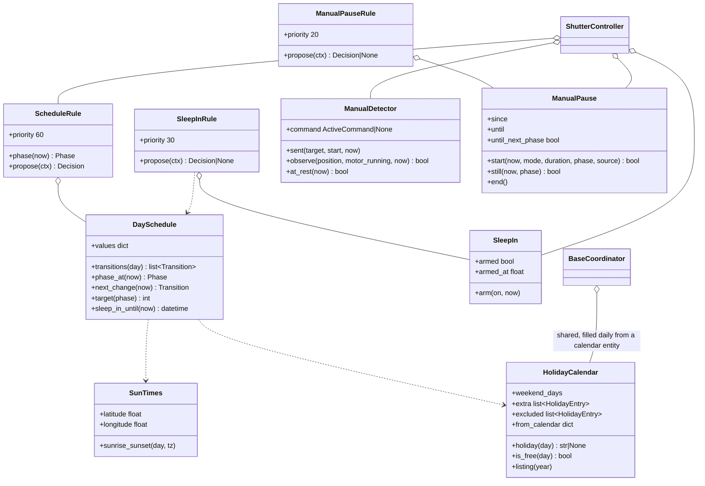
```mermaid
classDiagram
    direction TB
    class DaySchedule {
        +values dict
        +transitions(day) list~Transition~
        +phase_at(now) Phase
        +next_change(now) Transition
        +target(phase) int
        +sleep_in_until(now) datetime
    }
    class SunTimes {
        +latitude float
        +longitude float
        +sunrise_sunset(day, tz)
    }
    class HolidayCalendar {
        +weekend_days
        +extra list~HolidayEntry~
        +excluded list~HolidayEntry~
        +from_calendar dict
        +holiday(day) str|None
        +is_free(day) bool
        +listing(year)
    }
    class ScheduleRule {
        +priority 60
        +phase(now) Phase
        +propose(ctx) Decision
    }
    class SleepIn {
        +armed bool
        +armed_at float
        +arm(on, now)
    }
    class SleepInRule {
        +priority 30
        +propose(ctx) Decision|None
    }
    class ManualDetector {
        +command ActiveCommand|None
        +sent(target, start, now)
        +observe(position, motor_running, now) bool
        +at_rest(now) bool
    }
    class ManualPause {
        +since
        +until
        +until_next_phase bool
        +start(now, mode, duration, phase, source) bool
        +still(now, phase) bool
        +end()
    }
    class ManualPauseRule {
        +priority 20
        +propose(ctx) Decision|None
    }
    DaySchedule ..> SunTimes
    DaySchedule ..> HolidayCalendar
    ScheduleRule o-- DaySchedule
    SleepInRule o-- SleepIn
    SleepInRule ..> DaySchedule
    ManualPauseRule o-- ManualPause
    ShutterController o-- ManualDetector
    ShutterController o-- ManualPause
    ShutterController o-- ScheduleRule
    ShutterController o-- SleepIn
    BaseCoordinator o-- HolidayCalendar : shared, filled daily from a calendar entity
```

The rule chain per shutter, by priority: `ManualPauseRule` (20, final while paused) → `SleepInRule` (30) →
`HeatProtectionRule` (40, cap) → `ScheduleRule` (60). A slit decision carries a module position
(`Decision.module`); caps do not lower it.

### 7.2 Evaluation with the last sent target

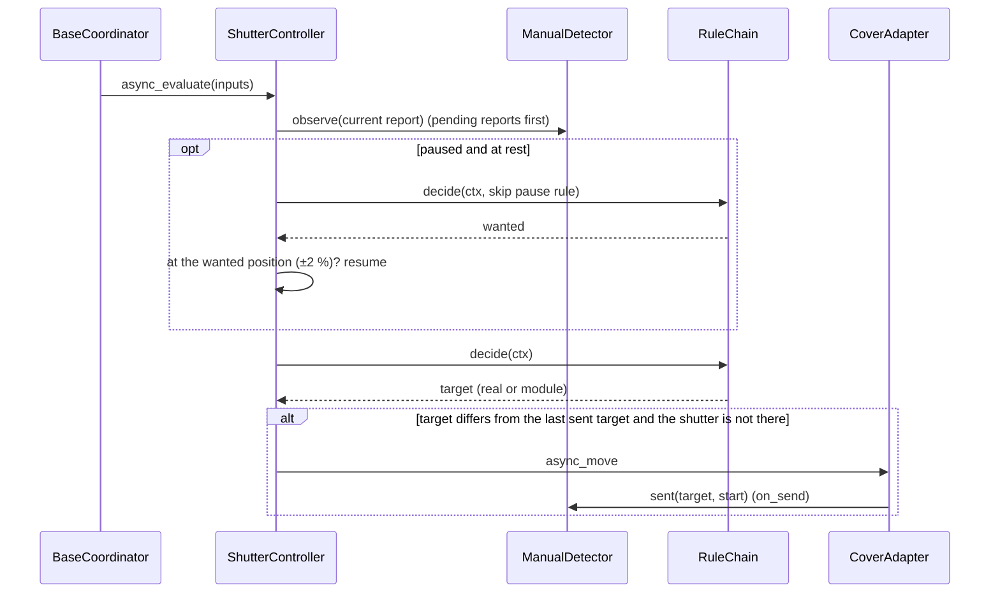
```mermaid
sequenceDiagram
    participant C as BaseCoordinator
    participant SC as ShutterController
    participant MD as ManualDetector
    participant R as RuleChain
    participant A as CoverAdapter
    C->>SC: async_evaluate(inputs)
    SC->>MD: observe(current report) (pending reports first)
    opt paused and at rest
        SC->>R: decide(ctx, skip pause rule)
        R-->>SC: wanted
        SC->>SC: at the wanted position (±2 %)? resume
    end
    SC->>R: decide(ctx)
    R-->>SC: target (real or module)
    alt target differs from the last sent target and the shutter is not there
        SC->>A: async_move
        A->>MD: sent(target, start) (on_send)
    end
```

The controller moves only when the target changes (a phase change, a setting, the end of a pause or of
sleep-in, heat protection starting or ending). A shutter moved by hand is recognised by `ManualDetector`:
any change that is not on the way of an own command, or the motor running without one.

### 7.3 Manual operation

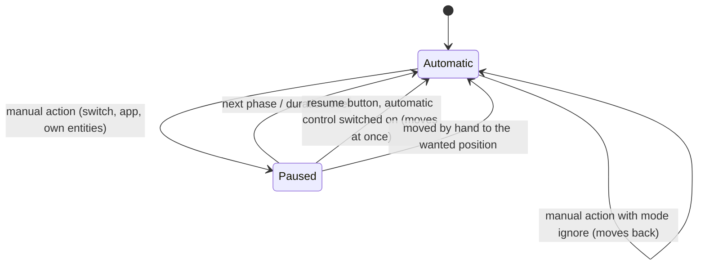
```mermaid
stateDiagram-v2
    [*] --> Automatic
    Automatic --> Paused: manual action (switch, app, own entities)
    Paused --> Automatic: next phase / duration over
    Paused --> Automatic: resume button, automatic control switched on (moves at once)
    Paused --> Automatic: moved by hand to the wanted position
    Automatic --> Automatic: manual action with mode ignore (moves back)
```

## 8. Weather and safety (#6)

Design: [`design/2026-11-20-weather-and-safety.md`](design/2026-11-20-weather-and-safety.md).

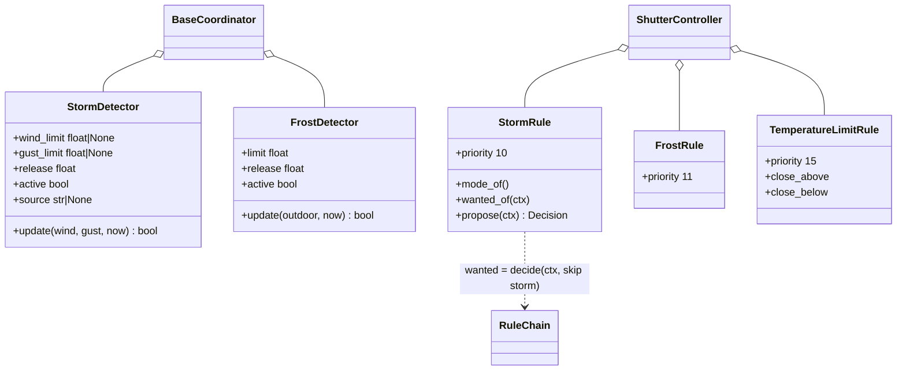
```mermaid
classDiagram
    class StormDetector {
        +wind_limit float|None
        +gust_limit float|None
        +release float
        +active bool
        +source str|None
        +update(wind, gust, now) bool
    }
    class FrostDetector {
        +limit float
        +release float
        +active bool
        +update(outdoor, now) bool
    }
    class StormRule {
        +priority 10
        +mode_of()
        +wanted_of(ctx)
        +propose(ctx) Decision
    }
    class FrostRule {
        +priority 11
    }
    class TemperatureLimitRule {
        +priority 15
        +close_above
        +close_below
    }
    BaseCoordinator o-- StormDetector
    BaseCoordinator o-- FrostDetector
    ShutterController o-- StormRule
    ShutterController o-- FrostRule
    ShutterController o-- TemperatureLimitRule
    StormRule ..> RuleChain : wanted = decide(ctx, skip storm)
```

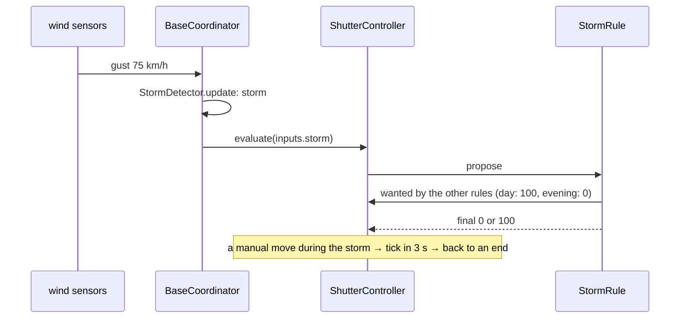
```mermaid
sequenceDiagram
    participant W as wind sensors
    participant C as BaseCoordinator
    participant SC as ShutterController
    participant S as StormRule
    W->>C: gust 75 km/h
    C->>C: StormDetector.update: storm
    C->>SC: evaluate(inputs.storm)
    SC->>S: propose
    S->>SC: wanted by the other rules (day: 100, evening: 0)
    S-->>SC: final 0 or 100
    Note over SC: a manual move during the storm → tick in 3 s → back to an end
```

## 9. Winter mode (#7)

Design: [`design/2026-11-20-winter.md`](design/2026-11-20-winter.md).

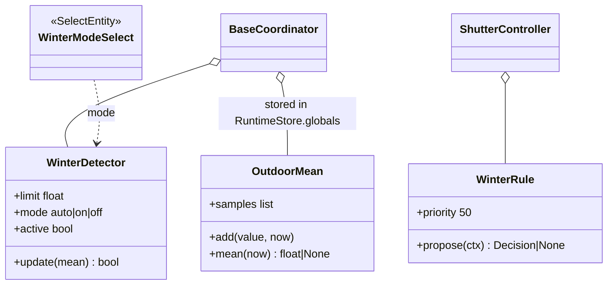
```mermaid
classDiagram
    class OutdoorMean {
        +samples list
        +add(value, now)
        +mean(now) float|None
    }
    class WinterDetector {
        +limit float
        +mode auto|on|off
        +active bool
        +update(mean) bool
    }
    class WinterRule {
        +priority 50
        +propose(ctx) Decision|None
    }
    class WinterModeSelect {
        <<SelectEntity>>
    }
    BaseCoordinator o-- OutdoorMean : stored in RuntimeStore.globals
    BaseCoordinator o-- WinterDetector
    WinterModeSelect ..> WinterDetector : mode
    ShutterController o-- WinterRule
```

`WinterRule` gives a target *closed* on a very cold day (below the manual pause, so a manual action
overrides it) and, in the dusk phase, a cap at the current position so the dusk position never raises a
closed shutter.

## 10. Lovelace card (#9)

Design: [`design/2026-11-20-card.md`](design/2026-11-20-card.md). TypeScript and Lit in `frontend/`, built
into `custom_components/smart_shutter_control/frontend/smart-shutter-card.js`, served by the integration.

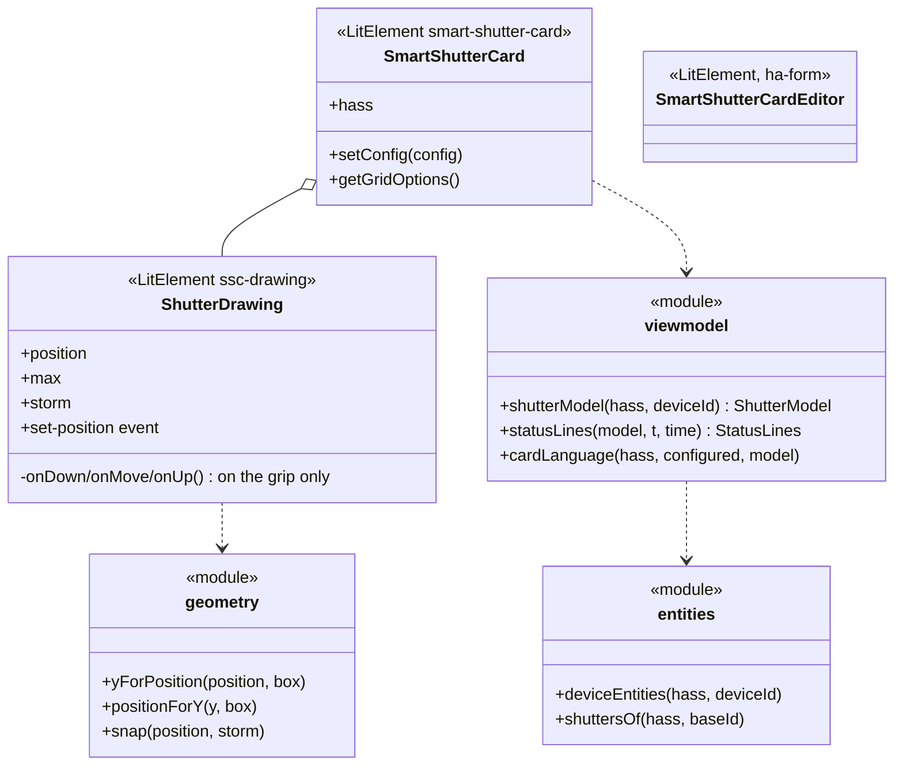
```mermaid
classDiagram
    class SmartShutterCard {
        <<LitElement smart-shutter-card>>
        +setConfig(config)
        +hass
        +getGridOptions()
    }
    class ShutterDrawing {
        <<LitElement ssc-drawing>>
        +position
        +max
        +storm
        +set-position event
        -onDown/onMove/onUp() on the grip only
    }
    class viewmodel {
        <<module>>
        +shutterModel(hass, deviceId) ShutterModel
        +statusLines(model, t, time) StatusLines
        +cardLanguage(hass, configured, model)
    }
    class geometry {
        <<module>>
        +yForPosition(position, box)
        +positionForY(y, box)
        +snap(position, storm)
    }
    class entities {
        <<module>>
        +deviceEntities(hass, deviceId)
        +shuttersOf(hass, baseId)
    }
    class SmartShutterCardEditor {
        <<LitElement, ha-form>>
    }
    SmartShutterCard o-- ShutterDrawing
    SmartShutterCard ..> viewmodel
    ShutterDrawing ..> geometry
    viewmodel ..> entities
```

The card finds entities by translation key on the device, so renamed entities keep working. The language is
the card option, else the `language` attribute of the shutter's *Reason* sensor (the integration's setting),
else the user's profile language.

## 11. Light sensors as the sun source (#26)

Design: [`design/2026-11-20-light-sensor.md`](design/2026-11-20-light-sensor.md).

```mermaid
classDiagram
    class SunnyDetector {
        +reference ClearSkyReference
        +threshold float
        +baseline PvBaseline|LuxBaseline
        +update(sun, value, weather, now) bool
        +factor float|None
        +source str
        +value float|None
    }
    class PvBaseline {
        <<strategy>>
        +pv_peak_kw
        +young_reference(sun, threshold)
        +hysteresis(threshold, young)
    }
    class LuxBaseline {
        <<strategy>>
        +limit_lux
        +young_reference(sun, threshold)
        +hysteresis(threshold, young)
    }
    SunnyDetector o-- ClearSkyReference
    SunnyDetector o-- PvBaseline
    SunnyDetector o-- LuxBaseline
    BaseCoordinator o-- SunnyDetector : sun source (PV or light)
    ShutterController o-- SunnyDetector : facade light sensor
```

`BaseCoordinator.sun_value()` gives the PV sum or the highest lux, by the sun source. The learned references
are stored under `clear_sky` (PV) and `clear_sky_lux` (light), a facade sensor's with its shutter. A shutter
with a facade sensor replaces `sunny` and `sun_factor` in its copy of the inputs before the rules run.

## 12. The view through the window (#30, #34)

Designs: [`design/2026-11-20-window-view.md`](design/2026-11-20-window-view.md),
[`design/2026-11-21-window-view-sky.md`](design/2026-11-21-window-view-sky.md).

```mermaid
flowchart LR
  A["attributes: sun azimuth/elevation, weather, cloud_coverage, state (Sun factor), wind/gust (Storm), window direction and facade sun_factor (Sun on the window)"] --> I["viewmodel.outsideInputs"]
  T["time, location (hass.config)"] --> I
  I --> S["scene.sceneFor → Scene (pure)"]
  M["moon.moonPhase / moonPosition (pure)"] --> S
  U["sun.sunPosition (pure)"] --> S
  S --> V["view.renderView: SVG layers under the slats"]
```

```mermaid
classDiagram
    class scene {
        <<module, pure>>
        +sceneFor(inputs) Scene
        +cloudCover(weather, cloudCoverage, sunFactor) number
        +veil(sunFactor, cover) Veil
        +sunPath(date, lat, lon, windowAzimuth) Place[][]
        +sideLight(sunAzimuth, sunElevation, windowAzimuth, cover) SideLight
        +landscape(windowAzimuth) Landscape
        +placeInWindow(azimuth, elevation, windowAzimuth) Place
    }
    class Scene {
        +sun Place
        +glow number
        +veil Veil
        +path Place[][]
        +cover number
        +cloudCount number
        +overcast bool
        +sideLight SideLight
        +landscape Landscape
    }
    class sun {
        <<module, pure>>
        +sunPosition(date, lat, lon)
    }
    class moon {
        <<module, pure>>
        +moonPhase(date)
        +moonPosition(date, lat, lon)
    }
    scene ..> sun
    scene ..> moon
    scene --> Scene : builds
```

`scene.ts` decides what is visible (light, sun and moon place, the sun's path, cloud cover and the cloud in
front of the sun, the landscape and side light of this window direction, weather, season, sway); `view.ts`
only draws it, in the glass area of `ssc-drawing`, under the curtain. The cloud cover mixes the weather
entity (cloud coverage or condition) with the measured sun factor (the facade sensor's when the shutter has
one), the latter weighing three times as much by day. The closed slat pattern is opaque; the open
pattern's slots are transparent, so the view shows through them.

## 13. Glare protection (#36)

Design: [`design/2026-11-21-glare-protection.md`](design/2026-11-21-glare-protection.md).

```mermaid
classDiagram
    class GlareProtectionRule {
        <<cap>>
        +priority 41
        +settings SunSettings
        +day_phase(now) Phase
        +phase Phase
        +propose(ctx) Decision|None
    }
    class HeatProtectionRule {
        <<cap>>
        +priority 40
        +settings SunSettings
    }
    class WindowGeometry {
        +sun_on(sun, max_incidence) bool
    }
    class ShutterContext {
        +glare_protection bool
        +glare_position int
        +glare_from float
    }
    class ScheduleRule {
        +phase(now) Phase
    }
    GlareProtectionRule ..> WindowGeometry
    HeatProtectionRule ..> WindowGeometry
    GlareProtectionRule ..> ShutterContext
    GlareProtectionRule ..> ScheduleRule : day phase
    ShutterController o-- GlareProtectionRule
```

```mermaid
stateDiagram-v2
    [*] --> Open
    Open --> Pending: day phase, sun on window, sun factor ≥ glare_from
    Open --> Shading: the same, at the first evaluation after a start
    Pending --> Open: a condition falls away
    Pending --> Shading: held for close_delay
    Shading --> Leaving: sun factor < glare_from − 15 points (or not sunny)
    Leaving --> Shading: bright again
    Leaving --> Open: open_delay passed, the sun left the window, or the day phase ended
```

`GlareProtectionRule` reuses the phases of heat protection (`core.heat.Phase`) and its `SunSettings` (largest
angle of incidence, delays), but not the temperature. The sun factor is `Inputs.sun_factor`: the base
controller's, or the facade sensor's when the shutter has one. Its phase is the attribute `glare_phase` of
*Sun on the window*. The switch *Glare protection* and the numbers *Glare position* and *Glare from* are kept
in the `RuntimeStore`, with the subentry's values as defaults.

## 14. Calibration table (#40)

Design: [`design/2026-11-21-calibration-table.md`](design/2026-11-21-calibration-table.md).

```mermaid
classDiagram
    class ShutterSubentryFlow {
        +async_step_calibrate() menu
        +async_step_cal_assistant()
        +async_step_cal_table()
        +async_step_cal_table_review()
    }
    class calibration_table {
        <<module, pure>>
        +rows_from(data) list
        +slits_from(data) dict
        +check(rows) list~str~
        +data_from(rows, slits, height_cm) dict
    }
    class RollerCalibration {
        +from_data(data)$
        +summary() dict
    }
    ShutterSubentryFlow ..> calibration_table
    ShutterSubentryFlow ..> RollerCalibration : review
```

```mermaid
sequenceDiagram
    participant U as User
    participant F as ShutterSubentryFlow
    participant T as calibration_table
    participant R as RollerCalibration
    U->>F: Calibrate → Edit table
    F->>T: rows_from(stored calibration)
    F-->>U: object selector with the rows, slits
    U->>F: edited rows
    F->>T: check(rows)
    alt errors
        F-->>U: the form again, with the error
    else fine
        F->>T: data_from(rows, slits, height)
        F->>R: from_data(data).summary()
        F-->>U: result (module position for 50 %, fit)
        U->>F: submit
        F->>F: async_update_and_abort(calibration)
    end
```

The stored format is unchanged (`points` per direction as fractions, `slit`, `window_height_cm`); the table
only converts it to whole percentages and back. The column labels of the object selector come from
`TABLE_LABELS` (en, nl), as its fields have no translation keys.

## 15. The decision of every rule (#56)

`RuleChain.decide` builds a `TraceEntry` per rule while it decides, and keeps the list of the last full
decision (not of a decision with a skipped rule) as `last_trace`. A rule that proposes nothing sets
`why = (code, values)` during `propose`; the chain clears it before asking. `WindowGeometry.why_not` gives
the codes for a sun that is not on the window. The *Reason* sensor shows the trace as the attribute
`decision` (not recorded); the card turns it into localized lines under **Why?**.

```mermaid
sequenceDiagram
    participant SC as ShutterController
    participant RC as RuleChain
    participant R as Rule
    participant S as ReasonSensor
    SC->>RC: decide(ctx)
    loop by priority
        RC->>R: why = None, propose(ctx)
        R-->>RC: Decision or None (+ why)
        RC->>RC: append TraceEntry
    end
    RC->>RC: mark the applied entry, last_trace
    RC-->>SC: Decision
    S->>SC: trace()
    SC-->>S: [entry.as_dict()] (empty while automatic control is off)
```

## 16. Horizon per window (#54)

`Horizon` (`core/horizon.py`, pure) holds `(azimuth, elevation)` points of a window; `WindowGeometry` uses
the higher of the horizon in the sun's direction and the lowest elevation. The points live in the shutter's
subentry (`horizon`). The button *Sun has left the window* stores a point without a reload: the coordinator
applies it to the running controller and marks the subentry update as quiet, so the update listener skips
the reload once. The table step *Horizon* saves like the other settings (with a reload).

```mermaid
sequenceDiagram
    participant U as User
    participant B as SunLeftButton
    participant C as BaseCoordinator
    participant SC as ShutterController
    participant HA as ConfigEntries
    U->>B: press
    B->>C: async_record_horizon(controller)
    C->>SC: horizon_with(sun) → set_horizon
    C->>HA: async_update_subentry (quiet)
    HA-->>C: update listener: quiet_update() → no reload
    C->>C: async_tick: the sun is off the window
```
